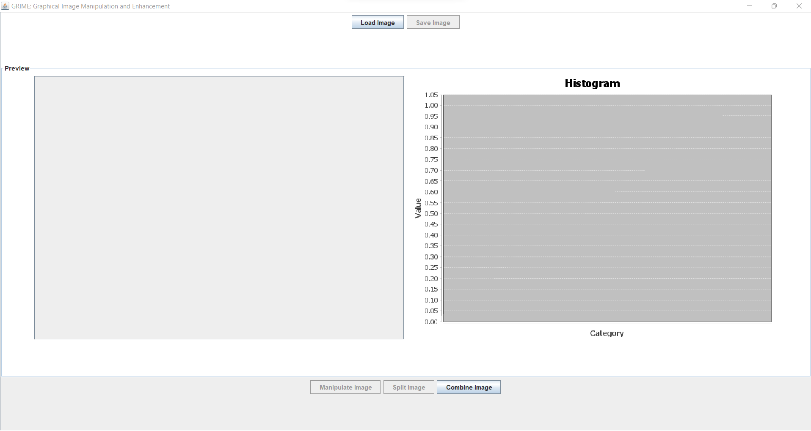
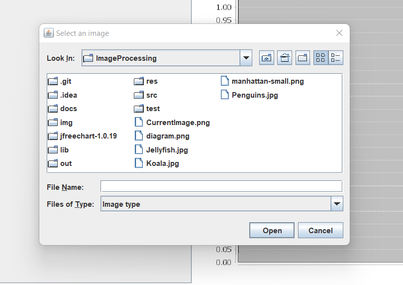
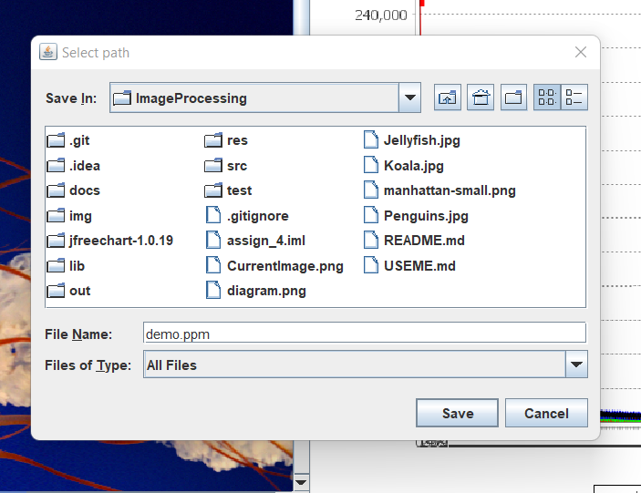
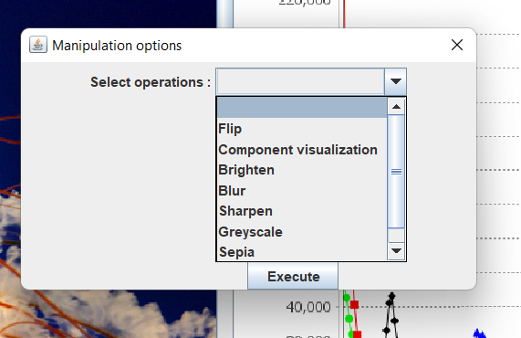
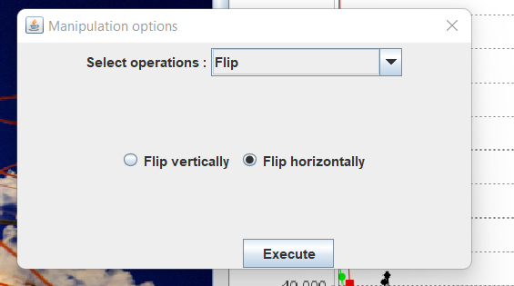
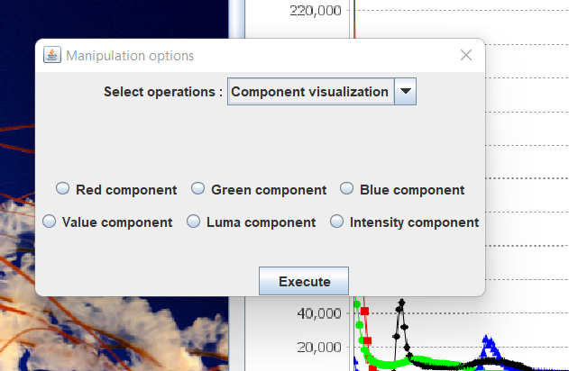
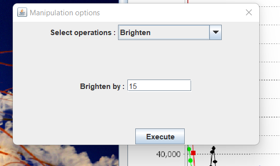
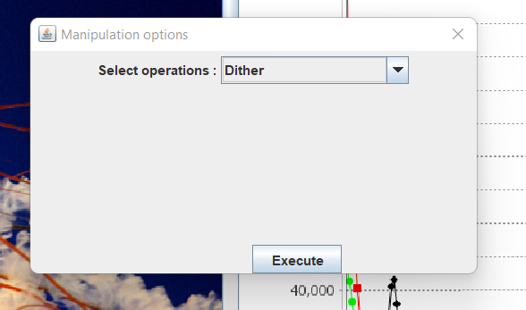
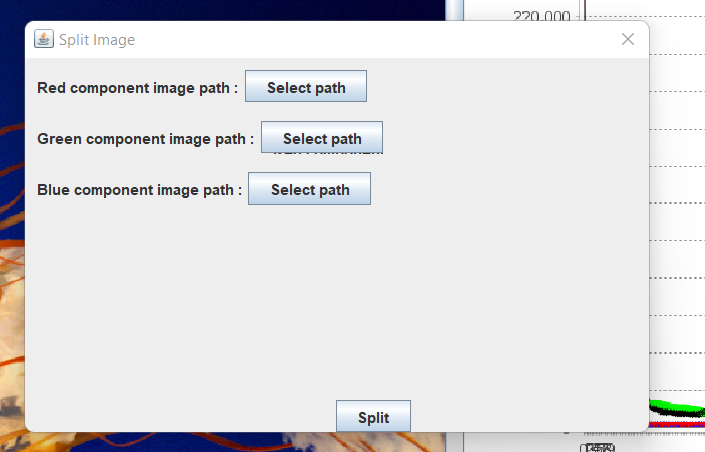
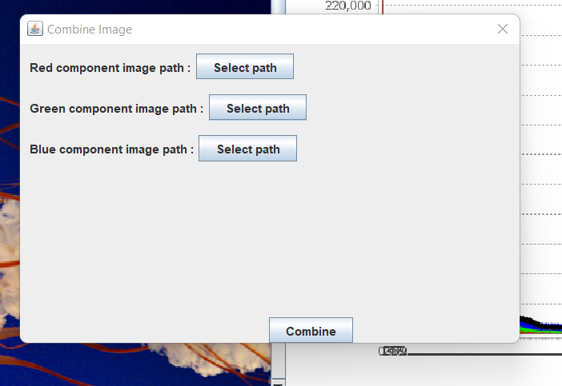

# How to use GUI

Please refer below image which represents basic structure of UI :

1. `Load Image (Ctrl + U)` : To load the image into UI click on Load Image button. 
 
   On Load Image button click a popup menu will open where one need to select image needs to be loaded.
   One can also use keyboard shortcut **Ctrl+U** to load the image.
    
   

2. `Save Image (Ctrl + S)` : To save the image on the given location click on Save Image button.
    
   On Save Image button click a popup menu will open where one need to select path and image name with its type to save.
   One can also use keyboard shortcut **Ctrl+S** to save the image.
    
   Please refer below image which will save image in PPM format with demo name on selected location.
   

3. `Preview` : Preview panel will contain loaded image and histogram of given image.
    
   Histogram will contain should show the red, green, blue and intensity components in line chart.

4. `Manipulate Image (Ctrl + M)` : To manipulate loaded image click on Manipulate Image button.
    
   On button click, a popup will open which will contains manipulation operations like flip, component visualization, greyscale, blurring, sharpening, sepia and dither image.
    
   Please refer below images :

- One need to select operations from the dropdown and click on execute button to reflect changes on the loaded image.
- It will also reflect changes on histogram.

5. `Split Image (Ctrl + X)` : To split loaded image into red, green and blue component click on Split Image button.
    
   On Split Image button click a popup menu will open where one need to select path to save red, green and blue greyscale images.
   One can also use Ctrl+X keyboard shortcut to split the image.
    
   

6. `Combine Image (Ctrl + C)` : To combine given images click on combine button.
    
   On button click, a popup will open where one need to select Red, Green and Blue greyscale images.
   One can also use Ctrl+C to combine images. New combined image will loaded in the preview.
    
   

# List of commands

The commands which are used in the application are as follows:

1. `load image-path image-name` :
    
   Load an image from the specified path and refer it to henceforth in the program by the given
   image name.
   Using the command one need to load image into the application before applying any other
   processing methods on it.

2. `save image-path image-name`:
    
   Save the image with the given name to the specified path which should include the name of the
   file.

3. `greyscale component-value image-name dest-image-name`:
    
   Create a greyscale image with the given component value of the image with the given name, and
   refer to it henceforth in the program by the given destination name.
   Component value based on the channels of the pixel like red, green, blue, value, luma, intensity.

4. `horizontal-flip image-name dest-image-name`:
    
   Flip an image with the given image name horizontally to create a new image, referred to
   henceforth by the given destination name.

5. `vertical-flip image-name dest-image-name`:
    
   Flip an image with the given image name vertically to create a new image, referred to henceforth
   by the given destination name.

6. `brighten increment image-name dest-image-name`:
    
   Brighten an image with the given image name by the provided increment to create a new image,
   referred to henceforth by the given destination name. The increment may be positive (brightening)
   or negative (darkening).

7. `rgb-split image-name dest-image-name-red dest-image-name-green dest-image-name-blue`:
    
   Split the given image into three greyscale images containing its red, green and blue components
   and referred to henceforth by the dest-image-name-red, dest-image-name-green,
   dest-image-name-blue respectively.

8. `rgb-combine image-name red-image green-image blue-image`:
    
   Combine the three greyscale images into a single image that gets its red, green and blue
   components from the three images respectively.

9. `filter filter-type image-name dest-image-name`:
    
    1. **filter blur image-name dest-image-name** :  
       Apply the gaussian blur to the image with given image name to create a new image, referred to
       henceforth by the given destination name.
    2. **filter sharpe image-name dest-image-name** :  
       sharpen the image with given image name to create a new image, referred to henceforth by the
       given destination name.

10. `color-transformation transformation-type image-name dest-image-name`:
     
    1. **color-transformation greyscale image-name dest-image-name** :  
       Apply the greyscale color transformation to the image to create a new image, referred to
       henceforth by the given destination name.
    2. **color-transformation sepia image-name dest-image-name** :  
       Apply the sepia tone to the image to create a new image, referred to henceforth by the given
       destination name.

11. `dither image-name dest-image-name`:
     
    Dither the image to create a new image, referred to henceforth by the given destination name.

12. `run path/script-file`:
     
    Load and run the script commands in the specified file.

## Commands to run from command-line

Open a command-prompt/terminal and navigate to the folder which contains jar file and run :

1. `java -jar NameOfJARFile.jar -file command-script.txt`:
    
   Run the script file command-script.txt from the terminal.

2. `java -jar NameOfJARFile.jar -text` :
    
   Using this command, we can make command line interactive with our application. One can
   write commands in the terminal and perform various image manipulation tasks interactively.
   One can run the script file using the "run res/command-script.txt" after running this
   interactive command line.

3. `java -jar NameOfJARFile.jar` :
    
   Using this command, we can use the Graphical User Interface for our application.
    
   The GUI, provides the privilege to load an image, perform operation by clicking
   respective buttons and also saving the image at the desired location.
